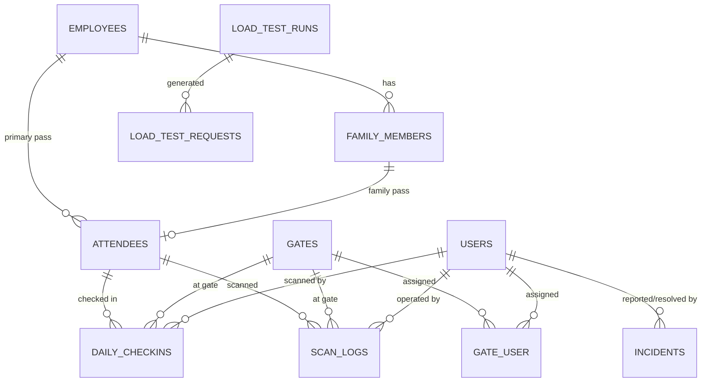

# Migration Audit: ONGC Navratri QR Entry Control System

**Generated:** 23 September 2026  
**Source Codebase:** Laravel 13.x / PHP 8.3 / MariaDB / Blade / Tailwind CSS / Alpine.js  
**Target Architecture:** Next.js (App Router, TypeScript, Tailwind) + NestJS (TypeScript, PostgreSQL, Prisma, Redis)

---

## 1. Executive Summary

This document establishes the authoritative system audit of the current ONGC Navratri QR Entry Control System. The existing Laravel application is in active production and serves as the **unquestioned source of truth** for all business rules, event rules, QR logic, check-in validation pipelines, role-based access control, report metrics, and traffic simulation mechanics.

The migration will rebuild the system into a modern, decoupled monorepo (`apps/web` and `apps/api`) while preserving 100% of the operational and business semantics. The existing Laravel application will remain untouched and functional throughout development.

---

## 2. Existing Modules

| Module | Primary Controller | Primary Models | Purpose |
| :--- | :--- | :--- | :--- |
| **Public Event Portal** | `PublicController` | `Setting`, `Attendee` | Public event info, schedule, 9-night celebration overview, venue details, FAQs, contact, ticket lookup. |
| **EWC Registration** | `EwcRegistrationController` | `Employee`, `FamilyMember`, `Attendee` | Public self-service registration for ONGC employees + family passes; photo upload; instant pass display. |
| **Admin Authentication** | `AdminAuthController` | `User` | Session-based authentication by Email or Staff ID; role resolution; demo bypass toggle; secure logout. |
| **Dashboard** | `DashboardController` | `Attendee`, `DailyCheckin`, `Gate`, `User` | High-level operational overview, live check-in counts, gate distribution, recent activity feeds. |
| **Event Control** | `EventControlController` | `Setting`, `Gate`, `AuditLog`, `DailyCheckin` | Master event switch (Open/Closed), scanning toggle, emergency stop with mandatory reason, operational date override. |
| **Live Scanner** | `ScannerController` | `Attendee`, `DailyCheckin`, `ScanLog`, `Gate`, `User` | Fast camera-based QR code validation and atomic check-in execution with gate authorization and row locks. |
| **Gate Management** | `GateController` | `Gate`, `DailyCheckin`, `ScanLog` | CRUD for gates, capacity limits, auto-blocking when full, open/closed toggles, sort ordering. |
| **Staff Management** | `StaffController` | `User`, `Gate` | Staff user creation, gate assignment mapping, status toggling, operator activity logs. |
| **Attendee Roster** | `AttendeeController` | `Attendee`, `Employee`, `FamilyMember` | Attendee management, grouped family views, bulk CSV exports, print-friendly passes, private employee photo serving. |
| **Bulk Upload** | `BulkUploadController` | `Attendee` | CSV batch importing with header validation and duplicate checks. |
| **Help Desk** | `HelpDeskController` | `Attendee`, `DailyCheckin`, `Gate`, `AuditLog` | Search by Ticket ID, Name, Mobile, or CPF (restricted); manual check-in with mandatory reason and audit record. |
| **Check-in Correction** | `CheckinCorrectionController` | `DailyCheckin`, `Attendee`, `AuditLog`, `ScanLog` | Voiding / reversing mistaken check-ins (`status = 'voided'`) with full audit history preservation. |
| **Incident Management** | `IncidentController` | `Incident`, `Gate`, `User`, `Attendee` | Logging operational issues (`INC-YYYYMMDD-XXXX`), assigning, tracking status, resolution notes. |
| **Daily Closing** | `DailyClosingController` | `DailyCheckin`, `ScanLog`, `Gate`, `User`, `Incident` | End-of-day reconciliation, peak hour calculation, gate breakdown, staff activity, CSV export. |
| **Audit Reports** | `ReportsController` | `Attendee`, `DailyCheckin`, `ScanLog`, `Gate`, `User` | Aggregate attendance, category breakdowns, gate performance, printable reports, CSV exports. |
| **Traffic Test Lab** | `TrafficTestController`, `LoadTestRunnerService` | `LoadTestRun`, `LoadTestRequest` | Background concurrent HTTP load testing engine simulating real scanner traffic with isolated test data. |
| **System Settings** | `SettingsController` | `Setting` | Key-value configuration for event dates, operational defaults, scanner timeouts, notifications. |
| **Maintenance** | `MaintenanceController` | N/A | Secret-key protected web runner for artisan tasks and migrations. |

---

## 3. Existing Database Schema

### Table Definitions & Key Attributes

#### `users`
- `id` (bigint, PK)
- `staff_id` (varchar, unique, nullable) — e.g. `SA-001`, `SC-001`
- `name` (varchar)
- `email` (varchar, unique)
- `mobile` (varchar, nullable)
- `password` (varchar, hashed)
- `role` (enum/varchar) — `SUPER_ADMIN`, `EVENT_ADMIN`, `GATE_MANAGER`, `SCANNER_STAFF`, `REGISTRATION_STAFF`, `REPORT_VIEWER`
- `status` (varchar, default `'active'`) — `'active'`, `'inactive'`
- `is_load_test` (boolean, default false)
- `load_test_run_id` (varchar, nullable)
- Timestamps (`created_at`, `updated_at`)

#### `gates`
- `id` (bigint, PK)
- `name` (varchar) — e.g. `Main Gate`, `Gate A`, `VIP Gate`
- `code` (varchar, unique) — e.g. `MAIN`, `G-A`, `VIP`
- `type` (varchar, default `'General'`) — `'General'`, `'VIP'`, `'Staff'`, `'Service'`
- `location` (varchar, nullable)
- `description` (text, nullable)
- `status` (varchar, default `'active'`) — `'active'`, `'inactive'`
- `is_open` (boolean, default true)
- `sort_order` (int, default 0)
- `maximum_capacity` (int, nullable)
- `capacity_enabled` (boolean, default false)
- `block_when_full` (boolean, default false)
- `is_load_test` (boolean, default false)
- `load_test_run_id` (varchar, nullable)
- Timestamps (`created_at`, `updated_at`)

#### `gate_user` (Pivot)
- `id` (bigint, PK)
- `user_id` (bigint, FK $\rightarrow$ `users.id`)
- `gate_id` (bigint, FK $\rightarrow$ `gates.id`)
- Timestamps (`created_at`, `updated_at`)
- Unique index on `[user_id, gate_id]`

#### `employees`
- `id` (bigint, PK)
- `name` (varchar)
- `mobile_no` (varchar, 10 digits)
- `cpf_no` (varchar, unique) — Employee CPF identifier
- `dob` (date)
- `date_of_joining` (date)
- `registration_reference` (varchar, unique) — e.g. `EWC-REF-XXXXXXXXXX`
- `photo_path` (varchar, nullable) — Path relative to private storage
- Timestamps (`created_at`, `updated_at`)

#### `family_members`
- `id` (bigint, PK)
- `employee_id` (bigint, FK $\rightarrow$ `employees.id`, cascade delete)
- `name` (varchar)
- `mobile_no` (varchar, nullable)
- Timestamps (`created_at`, `updated_at`)

#### `attendees` (Individual Entry Passes)
- `id` (bigint, PK)
- `ticket_id` (varchar, unique) — e.g. `EWC-100001` or `NR2026-000001`
- `secure_token` (varchar, unique, 64-char hex) — Cryptographic scan token
- `name` (varchar)
- `mobile` (varchar)
- `email` (varchar, nullable)
- `category` (varchar, default `'General'`) — `'ONGC STAFF'`, `'FAMILY MEMBER'`, `'General'`, `'VIP'`, `'VVIP'`
- `status` (varchar, default `'pending'`) — `'pending'`, `'checked_in'`, `'cancelled'`
- `checked_in_at` (timestamp, nullable) — Last check-in timestamp
- `gate` (varchar, nullable) — Last check-in gate name
- `booked_dates` (json, nullable) — Array of ISO dates e.g. `["2026-10-11", "2026-10-12"]`
- `duplicate_attempts` (int, default 0)
- `employee_id` (bigint, nullable, FK $\rightarrow$ `employees.id`)
- `family_member_id` (bigint, nullable, FK $\rightarrow$ `family_members.id`)
- `registration_reference` (varchar, nullable)
- `qr_path` (varchar, nullable)
- `is_load_test` (boolean, default false)
- `load_test_run_id` (varchar, nullable)
- Timestamps (`created_at`, `updated_at`)

#### `daily_checkins` (Historical Admissions Per Day)
- `id` (bigint, PK)
- `attendee_id` (bigint, FK $\rightarrow$ `attendees.id`)
- `event_date` (date) — Operational date of entry (`YYYY-MM-DD`)
- `gate_id` (bigint, nullable, FK $\rightarrow$ `gates.id`)
- `staff_id` (bigint, nullable, FK $\rightarrow$ `users.id`)
- `checked_in_at` (timestamp)
- `status` (varchar, default `'active'`) — `'active'`, `'voided'`
- `voided_at` (timestamp, nullable)
- `voided_by` (bigint, nullable, FK $\rightarrow$ `users.id`)
- `void_reason` (text, nullable)
- `is_manual` (boolean, default false)
- `manual_reason` (text, nullable)
- `is_load_test` (boolean, default false)
- `load_test_run_id` (varchar, nullable)
- Timestamps (`created_at`, `updated_at`)
- **Crucial Target Constraint for PostgreSQL:** `UNIQUE(attendee_id, event_date)`

#### `scan_logs` (Audit Log of Every Scan Attempt)
- `id` (bigint, PK)
- `attendee_id` (bigint, nullable, FK $\rightarrow$ `attendees.id`)
- `event_date` (date)
- `ticket_id_scanned` (varchar)
- `result` (varchar) — `'approved'`, `'duplicate'`, `'invalid'`, `'not_booked'`, `'event_closed'`, `'scanning_disabled'`, `'gate_closed'`, `'capacity_reached'`, `'unauthorized_gate'`, `'checkin_voided'`
- `error_reason` (text, nullable)
- `gate` (varchar, nullable)
- `gate_id` (bigint, nullable, FK $\rightarrow$ `gates.id`)
- `staff_id` (bigint, nullable, FK $\rightarrow$ `users.id`)
- `is_load_test` (boolean, default false)
- `load_test_run_id` (varchar, nullable)
- Timestamps (`created_at`, `updated_at`)

#### `incidents`
- `id` (bigint, PK)
- `incident_id` (varchar, unique) — `INC-YYYYMMDD-XXXX`
- `incident_date` (date)
- `incident_time` (time)
- `gate_id` (bigint, nullable, FK $\rightarrow$ `gates.id`)
- `staff_id` (bigint, nullable, FK $\rightarrow$ `users.id`)
- `attendee_id` (bigint, nullable, FK $\rightarrow$ `attendees.id`)
- `ticket_id` (varchar, nullable)
- `category` (varchar) — `TICKET_ISSUE`, `CAPACITY_LIMIT`, `DUPLICATE_CLAIM`, `SECURITY`, `MEDICAL`, `LOST_FOUND`, `OTHER`
- `description` (text)
- `status` (varchar, default `'OPEN'`) — `'OPEN'`, `'IN_REVIEW'`, `'RESOLVED'`
- `created_by` (bigint, nullable, FK $\rightarrow$ `users.id`)
- `resolved_by` (bigint, nullable, FK $\rightarrow$ `users.id`)
- `resolved_at` (timestamp, nullable)
- `resolution_notes` (text, nullable)
- Timestamps (`created_at`, `updated_at`)

#### `audit_logs`
- `id` (bigint, PK)
- `action` (varchar) — e.g. `checkin`, `manual_entry`, `checkin_reversed`, `emergency_stopped`, `event_date_changed`
- `user_id` (bigint, nullable, FK $\rightarrow$ `users.id`)
- `gate_id` (bigint, nullable, FK $\rightarrow$ `gates.id`)
- `attendee_id` (bigint, nullable, FK $\rightarrow$ `attendees.id`)
- `reason` (text, nullable)
- `metadata` (json, nullable)
- `ip_address` (varchar, nullable)
- `created_at` (timestamp)

#### `settings`
- `id` (bigint, PK)
- `key` (varchar, unique) — e.g. `event_control.event_status`, `event_control.scanning_enabled`
- `value` (text, nullable)
- `group` (varchar) — `general`, `event`, `qr`, `scanner`, `notifications`, `security`, `event_control`
- Timestamps (`created_at`, `updated_at`)

#### `load_test_runs`
- `id` (bigint, PK)
- `run_id` (varchar, unique) — `LT-YYYYMMDD-XXXX`
- `secret_token` (varchar, unique) — Cryptographic Bearer token
- `mode` (varchar) — `'dry_run'`, `'real_http'`
- `status` (varchar) — `'preparing'`, `'running'`, `'completed'`, `'failed'`, `'cancelled'`
- `target_url` (varchar)
- `total_attendees` (int)
- `total_staff` (int)
- `concurrency` (int)
- `scans_per_attendee` (int)
- `duration_seconds` (int)
- `scenario` (varchar) — `'normal'`, `'duplicate'`, `'invalid'`, `'not_booked'`, `'mixed'`
- `requests_total`, `requests_sent`, `requests_completed` (int)
- `count_success`, `count_duplicate`, `count_invalid`, `count_not_booked`, `count_error` (int)
- `rps`, `latency_avg`, `latency_p95`, `latency_p99`, `latency_max` (float)
- `bytes_sent`, `bytes_received` (bigint)
- `started_at`, `last_heartbeat_at`, `completed_at` (timestamp, nullable)
- `created_by` (bigint, nullable, FK $\rightarrow$ `users.id`)
- Timestamps (`created_at`, `updated_at`)

#### `load_test_requests`
- `id` (bigint, PK)
- `load_test_run_id` (bigint, FK $\rightarrow$ `load_test_runs.id`, cascade delete)
- `request_id` (varchar)
- `test_user_name`, `test_user_ticket`, `test_staff_name`, `gate_name` (varchar, nullable)
- `scenario`, `result` (varchar)
- `http_status` (int)
- `response_time_ms` (float)
- `bytes_sent`, `bytes_received` (int)
- `error_message` (text, nullable)
- Timestamps (`created_at`, `updated_at`)

---

## 4. Existing Routes & Endpoints

### Public Routes
- `GET /` $\rightarrow$ `PublicController@index` (Event Landing Page)
- `GET /about` $\rightarrow$ `PublicController@about`
- `GET /event` $\rightarrow$ `PublicController@event`
- `GET /schedule` $\rightarrow$ `PublicController@schedule` (9-night schedule + daily highlight)
- `GET /gallery` $\rightarrow$ `PublicController@gallery`
- `GET /faq` $\rightarrow$ `PublicController@faq`
- `GET /contact` $\rightarrow$ `PublicController@contact`
- `GET /information` $\rightarrow$ `PublicController@information`
- `GET /ticket` $\rightarrow$ `PublicController@ticketPage`
- `POST /ticket/lookup` $\rightarrow$ `PublicController@lookupTicket` (Rate limited: 10/min)
- `GET /register`, `GET /ewc-ahmedabad` $\rightarrow$ `EwcRegistrationController@create`
- `POST /ewc-ahmedabad` $\rightarrow$ `EwcRegistrationController@store` (Rate limited: 15/min)
- `GET /ewc-ahmedabad/tickets/{reference}` $\rightarrow$ `EwcRegistrationController@showTickets`
- `GET /tickets/{id}` $\rightarrow$ `AttendeeController@showTicket` (Digital Pass Display)

### Admin Authentication
- `GET /admin/login` $\rightarrow$ `AdminAuthController@showLoginForm`
- `POST /admin/login` $\rightarrow$ `AdminAuthController@login`
- `POST /admin/login/demo` $\rightarrow$ `AdminAuthController@demoLogin`
- `POST /admin/logout` $\rightarrow$ `AdminAuthController@logout`

### Admin Operational Routes (`/admin`, middleware: `admin.auth`)
- `GET /admin` $\rightarrow$ `DashboardController@index`
- `GET /admin/my-gate` $\rightarrow$ `DashboardController@myGate` (Scanner staff landing view)

#### Event Control (`role:SUPER_ADMIN,EVENT_ADMIN`)
- `GET /admin/event-control` $\rightarrow$ `EventControlController@index`
- `POST /admin/event-control/toggle-status` $\rightarrow$ `EventControlController@toggleEventStatus`
- `POST /admin/event-control/toggle-scanning` $\rightarrow$ `EventControlController@toggleScanning`
- `POST /admin/event-control/emergency-stop` $\rightarrow$ `EventControlController@emergencyStop`
- `POST /admin/event-control/emergency-resume` $\rightarrow$ `EventControlController@emergencyResume`
- `POST /admin/event-control/gates/{gate}/toggle-open` $\rightarrow$ `EventControlController@toggleGateOpen`
- `PUT /admin/event-control/gates/{gate}/capacity` $\rightarrow$ `EventControlController@updateGateCapacity`
- `POST /admin/event-control/set-date` $\rightarrow$ `EventControlController@setDate`
- `POST /admin/checkin/{checkin}/void` $\rightarrow$ `CheckinCorrectionController@void`

#### Help Desk & Incidents
- `GET /admin/help-desk` $\rightarrow$ `HelpDeskController@index`
- `POST /admin/help-desk/checkin` $\rightarrow$ `HelpDeskController@manualCheckin`
- `GET /admin/incidents` $\rightarrow$ `IncidentController@index`
- `POST /admin/incidents` $\rightarrow$ `IncidentController@store`
- `POST /admin/incidents/{incident}/resolve` $\rightarrow$ `IncidentController@resolve`

#### Gates & Staff Management
- `GET /admin/gates` $\rightarrow$ `GateController@index`
- `POST /admin/gates` $\rightarrow$ `GateController@store`
- `GET /admin/gates/{id}` $\rightarrow$ `GateController@show`
- `PUT /admin/gates/{id}` $\rightarrow$ `GateController@update`
- `POST /admin/gates/{id}/toggle-status` $\rightarrow$ `GateController@toggleStatus`
- `DELETE /admin/gates/{id}` $\rightarrow$ `GateController@destroy`
- `GET /admin/staff` $\rightarrow$ `StaffController@index`
- `POST /admin/staff` $\rightarrow$ `StaffController@store`
- `PUT /admin/staff/{id}` $\rightarrow$ `StaffController@update`
- `POST /admin/staff/{id}/toggle-status` $\rightarrow$ `StaffController@toggleStatus`
- `GET /admin/staff/{id}/activity` $\rightarrow$ `StaffController@activity`

#### Attendees & Registration
- `GET /admin/attendees` $\rightarrow$ `AttendeeController@index`
- `POST /admin/attendees` $\rightarrow$ `AttendeeController@store`
- `GET /admin/attendees/bulk/export` $\rightarrow$ `AttendeeController@bulkExport`
- `GET /admin/attendees/bulk/tickets` $\rightarrow$ `AttendeeController@bulkTickets`
- `POST /admin/attendees/bulk/regenerate-qr` $\rightarrow$ `AttendeeController@bulkRegenerateQr`
- `DELETE /admin/attendees/bulk` $\rightarrow$ `AttendeeController@bulkDestroy`
- `POST /admin/attendees/{id}/regenerate-qr` $\rightarrow$ `AttendeeController@regenerateQr`
- `GET /admin/attendees/{id}/qr-download` $\rightarrow$ `AttendeeController@downloadQr`
- `DELETE /admin/attendees/{id}` $\rightarrow$ `AttendeeController@destroy`
- `GET /admin/employees/{id}/photo` $\rightarrow$ `AttendeeController@employeePhoto` (Protected photo stream)
- `GET /admin/bulk-upload` $\rightarrow$ `BulkUploadController@create`
- `POST /admin/bulk-upload` $\rightarrow$ `BulkUploadController@store`
- `POST /admin/bulk-upload/validate` $\rightarrow$ `BulkUploadController@validateCsv`

#### Live Scanner (`role:SUPER_ADMIN,EVENT_ADMIN,GATE_MANAGER,SCANNER_STAFF`)
- `GET /admin/scanner` $\rightarrow$ `ScannerController@index`
- `GET /scanner/ping` $\rightarrow$ `ScannerController@ping`
- `POST /scanner/validate` $\rightarrow$ `ScannerController@validateTicket`
- `POST /scanner/checkin` $\rightarrow$ `ScannerController@checkIn`

#### Reports & Daily Closing
- `GET /admin/daily-closing` $\rightarrow$ `DailyClosingController@index`
- `GET /admin/daily-closing/export` $\rightarrow$ `DailyClosingController@export`
- `GET /admin/reports` $\rightarrow$ `ReportsController@index`
- `GET /admin/reports/print` $\rightarrow$ `ReportsController@print`
- `GET /admin/reports/export` $\rightarrow$ `ReportsController@export`

#### Settings & Traffic Testing (`role:SUPER_ADMIN,EVENT_ADMIN`)
- `GET /admin/settings` $\rightarrow$ `SettingsController@index`
- `POST /admin/settings/reset-data` $\rightarrow` `SettingsController@resetEventData`
- `POST /admin/settings/{group}` $\rightarrow` `SettingsController@updateGroup`
- `GET /admin/traffic-test` $\rightarrow` `TrafficTestController@index`
- `POST /admin/traffic-test/start` $\rightarrow` `TrafficTestController@start`
- `GET /admin/traffic-test/runs/{run}/status` $\rightarrow` `TrafficTestController@status`
- `POST /admin/traffic-test/runs/{run}/stop` $\rightarrow` `TrafficTestController@stop`
- `GET /admin/traffic-test/runs/{run}/export` $\rightarrow` `TrafficTestController@exportCsv`
- `POST /admin/traffic-test/runs/{run}/cleanup` $\rightarrow` `TrafficTestController@cleanup`

#### Dedicated Load Test Ingestion Endpoint
- `POST /traffic-test/checkin` $\rightarrow` `TrafficTestController@loadTestCheckIn` (Guarded by Bearer token & `LOAD_TESTING_ENABLED=true`)

---

## 5. Existing Role Hierarchy & Permissions

| Role | Dashboard | Event Control | Gates & Staff | Attendees & Photos | Scanner | Help Desk | Incidents | Reports & Closing | Traffic Test | Settings |
| :--- | :---: | :---: | :---: | :---: | :---: | :---: | :---: | :---: | :---: | :---: |
| **`SUPER_ADMIN`** | &check; Full | &check; Full | &check; Full | &check; Full + Photos | &check; All Gates | &check; Full (CPF Search) | &check; Full | &check; Full | &check; Full | &check; Full |
| **`EVENT_ADMIN`** | &check; Full | &check; Full | &check; Full | &check; Full + Photos | &check; All Gates | &check; Full (CPF Search) | &check; Full | &check; Full | &check; Full | &check; Full |
| **`GATE_MANAGER`** | &check; Full | &cross; | &check; Read-only | &cross; | &check; Assigned Gates | &check; (No CPF) | &check; Log/View | &check; Full | &cross; | &cross; |
| **`SCANNER_STAFF`** | Redirect $\rightarrow$ `my_gate` | &cross; | &cross; | &cross; | &check; Assigned Gate Only | &check; (No CPF) | &check; Log only | &cross; | &cross; | &cross; |
| **`REGISTRATION_STAFF`** | &check; Full | &cross; | &cross; | &check; Full + Photos | &cross; | &check; Full (CPF Search) | &cross; | &cross; | &cross; | &cross; |
| **`REPORT_VIEWER`** | &check; Read-only | &cross; | &cross; | &cross; | &cross; | &cross; | &cross; | &check; Full | &cross; | &cross; |

---

## 6. Existing Business & Security Rules

1. **Active Operational Event Date:**
   - Evaluated as `Setting::get('event_control.active_event_date')` if explicitly set in Event Control; otherwise evaluates `Carbon::today('Asia/Kolkata')->toDateString()`.
   - All check-in validations and multi-day checks use this date.
2. **Event Operational Status:**
   - When `event_status !== 'open'`, any scan attempt is immediately blocked with HTTP 403 `event_closed`.
3. **Emergency Stop:**
   - Master kill switch `emergency_stopped = 1` immediately suspends all gate scanning across the entire venue with HTTP 403 `scanning_disabled`. Requires a mandatory reason logged to `audit_logs`.
4. **Gate Operational State & Capacity:**
   - Gate must be `is_active = true` AND `is_open = true`. Otherwise returns HTTP 403 `gate_closed`.
   - When `capacity_enabled = true` and `block_when_full = true`, if active entries $\ge$ `maximum_capacity`, returns HTTP 403 `capacity_reached`.
5. **Staff Gate Authorization:**
   - Non-admin staff cannot scan at a gate unless mapped in `gate_user`. Mismatched gate attempts are logged as security violations (`unauthorized_gate`) with HTTP 403.
6. **Multi-Day Booking:**
   - If attendee has `booked_dates` populated, current event date MUST exist in that list. Otherwise returns `not_booked_today` and logs `not_booked`.
7. **Duplicate Prevention:**
   - Existing active check-in on `daily_checkins` for `[attendee_id, event_date]` returns `already_checked_in`, increments `attendee.duplicate_attempts`, and logs `duplicate`.
8. **Check-in Atomicity:**
   - Row-level lock `lockForUpdate()` is held on `attendee` and `daily_checkins` inside a database transaction to prevent concurrent twin-scan approvals.
9. **Private Photo Storage:**
   - Employee photos are stored in `storage/app/private/employee_photos` (outside `public/`). Only accessible to authorized admin roles via `/admin/employees/{id}/photo`.
10. **Load Test Isolation:**
    - All synthetic test records carry `is_load_test = true` and `load_test_run_id`.
    - Eloquent's `WithoutLoadTestScope` filters out synthetic data from standard reports, daily closing, and gate counts.
    - Real load test traffic requires a cryptographic bearer token generated per run and `LOAD_TESTING_ENABLED=true`.

---

## 7. Migration Risks & Mitigations

| Risk | Impact | Mitigation in New Architecture |
| :--- | :--- | :--- |
| **Concurrent Double-Check-in Race Condition** | Two scanners scanning the same QR simultaneously could both record an entry. | 1. Database-level `UNIQUE(attendee_id, event_date)` constraint in PostgreSQL. 2. Redis distributed lock or PostgreSQL transaction with `SELECT ... FOR UPDATE`. |
| **Timezone Inconsistencies** | Midnight rollover causing scans to register on incorrect event dates. | Set NestJS application and day calculation to `Asia/Kolkata` explicitly; keep timestamps in UTC. |
| **Photo Security Leakage** | Employee photos exposed via public URLs. | Dedicated streaming endpoint in NestJS guarded by `JwtAuthGuard` and `RoleGuard(['SUPER_ADMIN', 'EVENT_ADMIN', 'REGISTRATION_STAFF'])`. |
| **High Burst Scanner Concurrency** | Slow response times at peak arrival hours (e.g. 7:00 PM - 8:30 PM). | 1. Lightweight NestJS check-in handler optimized for $<20\text{ms}$ execution. 2. Redis caching for gate status, event status, and attendee lookups. 3. Real HTTP load testing in staging. |
| **Accidental Production Data Loss** | Migration scripts altering or corrupting active event records. | Zero writes to MySQL database. Read-only extraction scripts into PostgreSQL staging. |

---

## 8. Recommended Execution Order

1. **Phase 1: Project Setup & Monorepo Foundation** (pnpm, NestJS backend, Next.js frontend, shared packages).
2. **Phase 2: PostgreSQL Schema Definition** (`schema.prisma` with indexes, constraints, and `UNIQUE(attendee_id, event_date)`).
3. **Phase 3: Security & Cryptographic QR Engine** (32-byte secure tokens, SVG on-the-fly rendering).
4. **Phase 4: Registration & Private File Storage** (Employee + Family, validation, photo handling).
5. **Phase 5: Event Days & Multi-Date Engine** (`booked_dates` validation, operational date override).
6. **Phase 6 & 7: Atomic Check-in Engine & Scanner Responses** (Transaction, row lock, error codes, response structures).
7. **Phase 8 & 9: Staff, Gate Authorization & Event Control** (Gate capacity, emergency stop, open/close toggles).
8. **Phase 10 & 11: Scanner PWA Application & Heartbeat** (Camera scanning, audio cues, 8s heartbeat).
9. **Phase 12 - 14: Help Desk, Check-in Reversals & Incident Management** (Search, manual entry, void status).
10. **Phase 15 & 16: Reporting, Daily Closing & CSV Streaming** (Aggregation queries, IST formatted CSVs).
11. **Phase 17: Traffic Test Engine** (Isolated HTTP load testing with Bearer auth, live metrics).
12. **Phase 18 & 19: Public Event Portal & Admin UI** (Next.js 15, Tailwind, brand aesthetics).
13. **Phase 20: Automated Test Suite** (Concurrency testing, Playwright E2E, unit tests).
14. **Phase 21: Data Migration Scripts** (Extract from MySQL, validate, load into PostgreSQL).
15. **Phase 22: Staging Deployment & Real HTTP Load Testing**.
16. **Phase 23: Production Cutover Preparation**.
